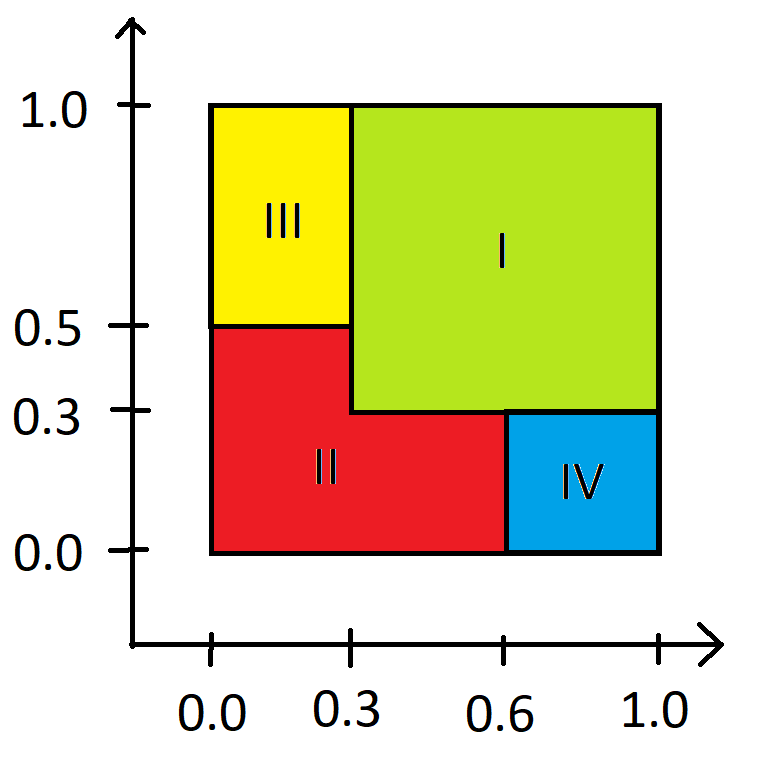

# dummy-ml

Dummy example of classifier using multilayer perceptron.



Inputs for model are coordinates of points inside unit square - the image above shows areas belonging to classes being matched by trained model.

## Usage

To be run in project's main directory:
```bash
# Generating training data
python src/training-data-generator.py && mv data.csv training_data.csv
# Generating testing data
python src/testing-data-generator.py && mv data.csv testing_data.csv
# Actual training
python src/main.py
```